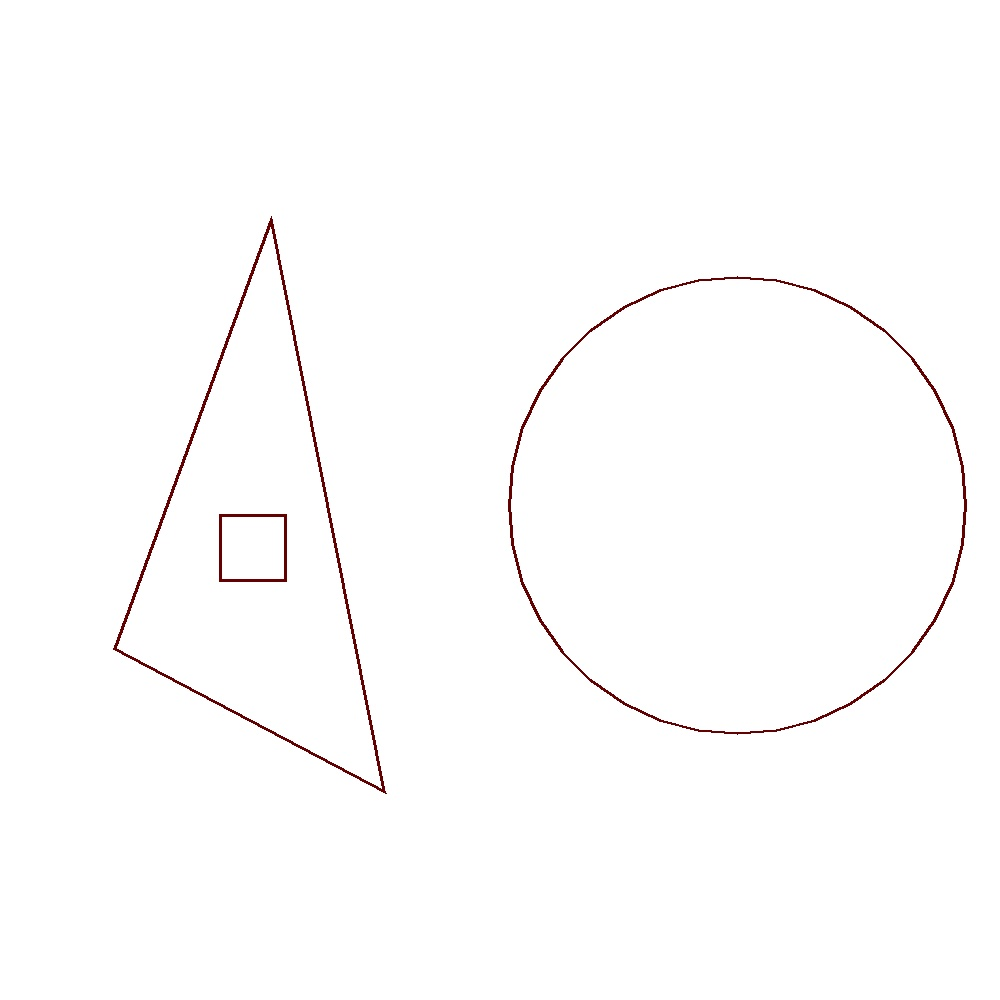

# Shape Generator
This is a random data generator for a machine learning project, with the goal of classifying spatial relationships of simple shapes in a picture.

Additions and improvements are welcome!
## Example usage:
```python
from shape_label_generation import triangle, square, circle, inside_of, left_of
from PIL import Image, ImageDraw

image_size = (1000,1000)
label = left_of(inside_of(triangle)(square))(circle)
image = Image.new("RGB", image_size, (255, 255, 255))
draw_picture(image, label, image_size)
print(label.linear_rep())
image.show()
```

Output:

